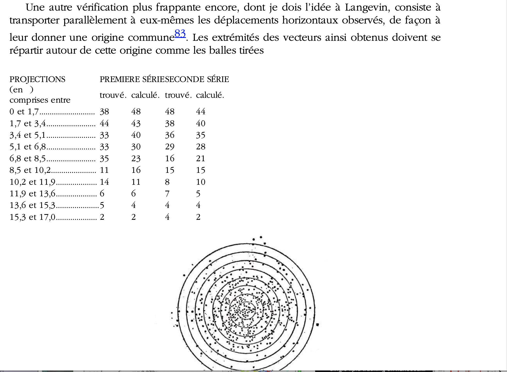

# Mesure d'un coefficient de diffusion d'une particule

Le but de ce premier projet est d'analyser le mouvement de deux particules browniennes (diamètre : 2 µm) : 
-  la première étant libre de déplacement
-  la seconde étant attirée par une [pince optique](https://fr.wikipedia.org/wiki/Pince_optique) ([Nobel de Physique 2018](https://www.nobelprize.org/prizes/physics/2018/ashkin/lecture/))

# Se rafraichir la mémoire sur les objectifs et le cadre scientifique

Les documents auxquels vous pouvez vous réferer sont : 
- Le TD sur la mesure du coefficient de diffusion que vous avez suivi en 4C201 (MicMac)
- Le livre de Jean Perrin intitulé "Les atomes", qui a servi à la construction du TD sus-cité

et pour aller plus loin et comprendre le caractère très général du travail que vous allez effectuer : 
- Les premières pages du cours de Bertrand Duplantier, donné lors d'un Séminaire Poincaré en 2005 ([lien](http://www.bourbaphy.fr/duplantier2.pdf))

# Principe général de l'analyse des films

Le but ici n'est pas de donner la solution mais de proposer des pistes de résolution. Mais nous pouvons donner malgré tout quelques éléments pour débuter.

1. La première chose à faire dans votre cas, avec Fiji ou Matlab/Octave, est de simplement traiter le film de la bille mobile de manière à obtenir sa position au cours du temps, sous la forme d'un tableau de données.

2. Quand vous aurez ce tableau de données, une manière simple de les représenter (avec Matlab/Octave) sera de suivre le conseil que Langevin avait donné à Perrin (discussion de géants...) résumé ici : 

# Credits

Ces films sont extraits de la thèse de doctorat d'Antoine Bérut (ILM, Lyon)
http://ilm-perso.univ-lyon1.fr/~aberut/
