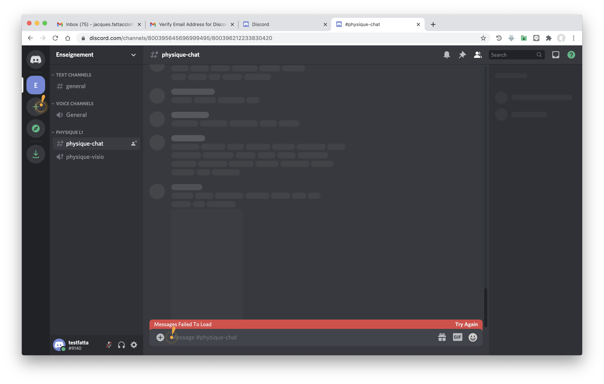

# Petit tuto pour mettre en place un serveur Discord pour l'enseignement

## Contexte

Enseignant dans un collège/lycée ou à l'université, vous dispensez des enseignements différents à des niveaux différents cette année.

Par exemple, vous donnez : 
- Une série de cours de physique au groupe de TD n°2 des L1
- Une série de cours de chimie à un petit groupe de L3

Vous voulez mettre en place un serveur Discord qui regroupe ces enseignements et les étudiants qui les suivent, et éventuellement des collègues qui vous aident.

Pour chaque niveau et chaque cours, vous voulez utiliser : 

- un canal de chat permanent (écrit) qui vous permet d'échanger avec les étudiants tout au long du semestre, poser des questions, etc.
- un canal de visio qui agira comme une salle de classe virtuelle, et à laquelle vous vous connecterez avec les étudiants pour un cours en synchrone.

Enfin, pour l'ensemble de votre serveur, vous voulez pouvoir faire des sondages simples, soit pour l'organisation, soit lors des cours synchrones pour vous assurer que les étudiants ont bien compris une notion.

Bien que ce qui est écrit ci-dessous ne soit pas exhaustif, vous pouvez suivre ce petit tuto qui vous montrera les premiers pas. 

Monter un serveur simple prend à peine 10 minutes.

## Création du compte Discord

Avant toute chose, il faut créer un compte permanent Discord à cette adresse : [lien](https://discord.com).

Il est plus pratique d'avoir l'application installée, mais vous pouvez aussi travailler directement dans le navigateur.

## Création du serveur pour vos enseignements

Nous sommes ici sur la capture d'écran de mon application Discord, et vous pouvez voir avec les icones sur la partie gauche de l'écran les différents serveurs, publics ou privés, auxquels je me suis inscrit.

Dans votre interface, ces icones n'apparaissent pas, puisque votre application est encore vierge, à l'exception du + qui vous permet d'ajouter un serveur.

Cliquez dessus, et une petite fenêtre apparaitra. Vous avez alors le choix : 
- De créer un serveur que vous configurerez complètement (Create my own)
- De créer un serveur en suivant un modèle.
- De rejoindre un serveur pour lequel vous avez reçu une invitation (Join a Server)

Choisissez la première option (Create my own)

La fenêtre suivante vous propose des options de personnalisation du serveur. Cliquez sur *Skip this question*

La fenêtre suivante vous propose de donner un nom à votre serveur. Ici nous avons choisi un nom très général *Enseignement* que vous pourrez personnaliser à votre guise.

## Création d'une catégorie et des canaux pour une classe

## Création de rôles (familles de membres)

