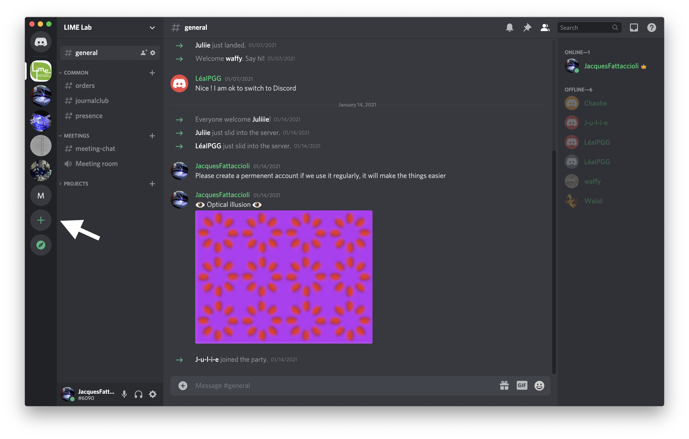

# Tutoriel pour mettre en place un serveur Discord pour l'enseignement
Date : 17 janvier 2021

## Contexte

Enseignant dans un collège/lycée ou à l'université, vous dispensez des enseignements différents à des niveaux différents cette année.

Par exemple, vous donnez : 
- Une série de cours de physique au groupe de TD n°1 des L1
- Une série de cours de chimie à un petit groupe de L3

Vous voulez mettre en place un serveur Discord qui regroupe ces enseignements et les étudiants qui les suivent, et éventuellement des collègues qui vous aident.

Pour chaque niveau et chaque cours, vous voulez utiliser : 

- un canal de chat permanent (écrit) qui vous permet d'échanger avec les étudiants tout au long du semestre, poser des questions, etc.
- un canal de visio qui agira comme une salle de classe virtuelle, et à laquelle vous vous connecterez avec les étudiants pour un cours en synchrone.

Enfin, pour l'ensemble de votre serveur, vous voulez pouvoir faire des sondages simples, soit pour l'organisation, soit lors des cours synchrones pour vous assurer que les étudiants ont bien compris une notion.

Bien que ce qui est écrit ci-dessous ne soit pas exhaustif, vous pouvez suivre ce petit tuto qui vous montrera les premiers pas. 

Monter un serveur simple prend à peine 10 minutes.

## Création du compte Discord

Avant toute chose, il faut créer un compte permanent Discord à cette adresse : [lien](https://discord.com).

Il est plus pratique d'avoir l'application installée, mais vous pouvez aussi travailler directement dans le navigateur.

## Création du serveur pour vos enseignements

Nous sommes ici sur la capture d'écran de mon application Discord, et vous pouvez voir avec les icones sur la partie gauche de l'écran les différents serveurs, publics ou privés, auxquels je me suis inscrit.

Dans votre interface, ces icones n'apparaissent pas, puisque votre application est encore vierge, à l'exception du + qui vous permet d'ajouter un serveur.

Cliquez dessus, et une petite fenêtre apparaitra. Vous avez alors le choix : 
- De créer un serveur que vous configurerez complètement (Create my own)
- De créer un serveur en suivant un modèle.
- De rejoindre un serveur pour lequel vous avez reçu une invitation (Join a Server)

Choisissez la première option (Create my own)

La fenêtre suivante vous propose des options de personnalisation du serveur. Cliquez sur *Skip this question*

La fenêtre suivante vous propose de donner un nom à votre serveur. Ici nous avons choisi un nom très général *Enseignement* que vous pourrez personnaliser à votre guise.

Si vous avez une icône ou une image pour représenter le serveur, vous pouvez cliquer sur le champ avec l'appareil photo. Cette opération peut être réalisée plus tard dans les paramètres du serveur.

Appuyez sur *Create*

Voilà, votre serveur est créé. 

Vous voyez deux canaux installés par défaut, dans deux catégories différentes : 

- TEXT CHANNELS / #general
- VOICE CHANNELS / #General

Ces canaux seront par défaut accessibles à toutes les personnes enregistrées sur votre serveur, et, notamment, le canal #general affichera les événements importants (arrivée ou départ d'un nouveau membre notamment).

## Création d'une catégorie et des canaux pour une classe

Il y a peut-être d'autres manières d'organiser votre serveur, mais voilà la manière dont j'ai procédé : 

- A chaque classe (L1 Groupe 1 ou L3) nous allons associer une catégorie
- Dans chaque catégorie, nous aurons plusieurs canaux (texte, visio)

La particularité de Discord est de pouvoir définir des *rôles*, à savoir des familles de membres, avec des droits particuliers. Les droits peuvent être accordés au niveau des canaux, ou au niveau des catégories.

Ici, les rôles correspondront à des groupes d'étudiants, d'enseignants, de collègues, etc. Nous les définirons plus tard dans le tuto.

Tout d'abord, cliquez sur *Enseignement* en haut à gauche, et vous verrez apparaître le menu suivant.

Cliquez sur *Create Category*

Dans la fenêtre qui apparaît : 
- Entrez un nom de catégorie qui correspondra à votre classe. Ici *Physique L1* puisque ca correspond à vos enseignments pour le groupe 1 des étudiants de L1
- Activez *Private Category* car cela facilitera la mise en place de droits différenciés des membres. Si cette case n'est pas activée, la catégorie sera accessible à tous les membres par défaut, à la création, et le paramétrage ultérieur sera plus fastidieux.
- Cliquez sur *Create Category*

Dans la nouvelle fenêtre qui apparaît, cliquez sur **Skip for now** car pour l'instant, vous n'avez pas défini de rôles particuliers.

Vous voilà revenus à la page principale du server, et vous voyez maintenant la catégorie **Physique L1** dans la partie gauche de l'écran.

Voilà le moment de créer vos canaux pour vos cours. Dans une catégorie, vous pouvez avoir un grand nombre de canaux, mais pour simplifier, nous allons créer un canal (*channel*) de type *text* et un canal de type *voice* (qui est en fait un canal de visio, avec possibilité de diffuser l'image prise par votre caméra ou un partage d'écran).

Cliquez sur le **+** de la catégorie **Physique L1** et vous voyez apparaître un popup affichant *Create Channel*

Dans la fenêtre qui apparaît, intitulée *Create a Private Channel*, veuillez : 
- Choisir **Text Channel** dans *CHANNEL TYPE*
- Donner un nom à votre canal, ici *#physique-chat*
- Activer l'option *Private channel*

Et enfin cliquer sur *Create Channel*

Dans la fenêtre suivante, choisissez l'option **Skip for now** car, comme pour les catégories, vous n'avez pas encore de rôles définis.

Après être revenu sur l'écran principal, vous voyez un canal intitulé **#physique-chat** dans la catégorie *Physique L1*. Si vous regardez attentivement, vous voyez un petit cadenas qui indique que ce canal est privé.

Pour créer le canal de visio, procédez de la même manière que ci-dessus : 
- Cliquez sur le **+** de la catégorie **Physique L1** et vous voyez apparaître un popup affichant *Create Channel*

Dans la fenêtre qui apparaît, intitulée *Create a Private Channel*, veuillez : 
- Choisir **Voice Channel** dans *CHANNEL TYPE*
- Donner un nom à votre canal, ici *#physique-visio*
- Activer l'option *Private channel*

Et enfin cliquer sur *Create Channel*

Dans la fenêtre suivante, choisissez l'option **Skip for now** car, comme pour les catégories, vous n'avez pas encore de rôles définis.

Voilà, vous avez maintenant la structure de base de votre enseignement de physique en L1. 

Il vous reste maintenant a assigner un rôle à vos futurs étudiants de L1, pour qu'ils puissent : 
- voir les deux canaux créés sur votre serveur
- participer, par écrit dans le canal texte, et par voix/visio dans le canal visio.

## Création de rôles (familles de membres)

La création de rôles est aisée, et permet un paramétrage très fin des actions permises à chaque groupe d'utilisateurs. 

Nous nous contenteront de paramétrages simples, car ceux-ci sont suffisants pour l'utilisation qui sera la nôtre.

Sur la page principale de votre nouveau serveur **Enseignement**, cliquez à droite du nom du serveur, puis sur **Server Settings**

Vous arrivez maintenant sur une page très dense, qui vous permet de paramétrer votre serveur : 

- Si vous n'aviez pas encore uploadé une photo ou une image de personnalisation du serveur, vous pouvez le faire maintenant dans la fenêtre **Overview**

Cliquez sur **Roles**

Appuyez sur **+** à coté de *Roles* et une ligne apparaît. 

- Inscrivez **L1Groupe1**
- Vous pouvez choisir une couleur qui permettra de différencier les membres qui appartiendront à ce groupe.
- Sélectionnez l'option **Display role members separately from online members** de manière à voir les rôles dans la liste des membres, notamment quand vous serez sur les canaux #general.
- Enfin cliquez sur **Save Changes**

Dans vos enseignements, vous avez aussi un groupe d'étudiant de L3, et vous préférez dès maintenant créer un rôle correspondant : 

 - Appuyez sur **+** à coté de *Roles* et une ligne apparaît. 
- Inscrivez **L3Meca**
- Vous pouvez choisir une couleur qui permettra de différencier les membres qui appartiendront à ce groupe.
- Enfin cliquez sur **Save Changes**

Nous revenons maintenant à la fenêtre principale, et nous allons associez les membres ayant le rôle **L1Groupe1** à leur catégorie d'enseignement **Physique L1**.

Pour celà, il faut faire un clic droit sur la catégorie **Physique L1** et sélectionner **Edit Category**

Dans la fenêtre qui apparait, vous pouvez choisir les rôles qui auront accès à la catégorie, et donc à tous les canaux qui en font partie.

Ici, nous choisissons le rôle **L1groupe1** car c'est à eux que l'enseignement de physique est destiné.

Enfin,cliquez **Done**

## Génération d'un lien d'invitation pour les nouveaux membres

Sur la page principale de votre nouveau serveur **Enseignement**, cliquez à droite du nom du serveur, puis sur **Invite People**

Dans la fenêtre qui apparaît, vous pouvez générer un lien (une URL) qui permettra à celles et ceux qui la reçoivent de pouvoir rejoindre votre serveur. 

Dans la partie haute de la fenêtre, vous avez la liste des membres existants des divers serveurs auxquels vous êtes connectés, et aux "amis".

Dans la partie basse, vous pouvez effectivement générer le lien.

Avant de copier le lien, il faut paramétrer quelques détails, aussi, il faut cliquer sur **Edit invite link**

Le lien permettant de rejoindre votre serveur peut : 
- expirer au bout d'un certain temps (par défaut : 1 jour). Choisissez **Never**
- expirer au bout d'un certain nombre de personnes ayant cliqué dessus. Choisissez **No limit**

Enfin cliquez, sur **Generate New Link**

## Inviter des étudiants ou des collègues à rejoindre votre serveur

Copiez le lien qui apparaît dans la nouvelle fenêtre.

Envoyez le par le moyen de votre choix aux personnes que vous souhaitez rejoindre votre serveur.

A partir de maintenant, il y a deux possibilités : 

- vos contacts ont un compte Discord, et se connecterons sans difficultés à ce nouveau serveur en cliquant sur le lien.
- vos contacts n'ont pas de compte actif, et devront en créer un après avoir cliqué sur le lien.

## Ajouter un nouveau membre à son rôle correspondant et lui donner accès à sa classe.

Un de vos contacts, dont le pseudo est **testfatta**, a rejoint votre serveur avec le lien que vous lui avez envoyé. 

Une notification apparaît dans le canal #general, avec le pseudo.

Pour l'instant, il n'a pas de rôle particulier et n'a donc accès qu'aux catégories et canaux publics, donc n'a pas accès aux canaux correspondants à l'enseignement qu'il doit suivre.

Pour assigner un rôle à ce nouvel utilisateur, il faut cliquer sur son pseudo dans le panneau à droite de la fenêtre. Un popup apparaît, avec la possibilité de cliquer sur **+** et de choisir un ou plusieur rôles. Dans notre cas, c'est un étudiant de L1, on choisit donc **L1groupe1**.

Dans son navigateur, le nouvel utilisateur **testfatta** voit maintenant apparaître la catégorie **Physique L1** et les canaux associés, et peut maintenant communiquer avec vous par chat ou visio.

Dans la vue de votre serveur, vous voyez maintenant les message que **testfatta** vous envoie.

## Quelques pistes pour la suite : 

Ca y est, votre serveur est fin prêt pour une première utilisation, et normalement, il n'y a plus de difficultés à partir de maintenant.

Vous pouvez malgré tout continuer la mise en place : 

- en ajoutant des rôles pour les collègues enseignants, qui auront accès à une ou plusieurs catégories. Comme vous avez pu le voir, vous pouvez d'abord créer les catégories, puis les rôles, ou l'inverse.

- en ajoutant un *bot* de sondage, comme [Simple Poll](https://top.gg/bot/simplepoll). Il faut choisir **Invite** dans la page et suivre les instructions. 

## Fin

Si vous constatez des erreurs ou des choses parfois plus simples à effectuer pour la configuration, n'hésitez pas à m'en faire part.
Un grand merci à deux collègues, l'une à l'université (@l_gonnord), le second au lycée (@P0litgeek) pour m'avoir acceuilli dans leurs cours en ligne lors du premier confinement (Printemps 2020). 

